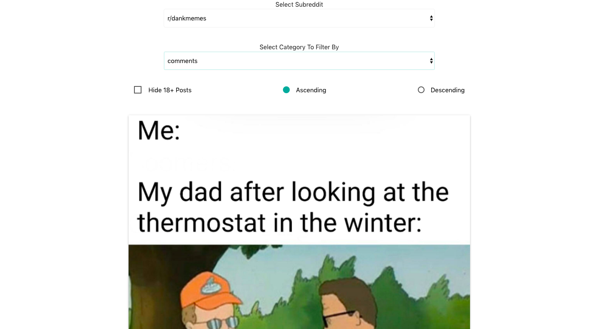
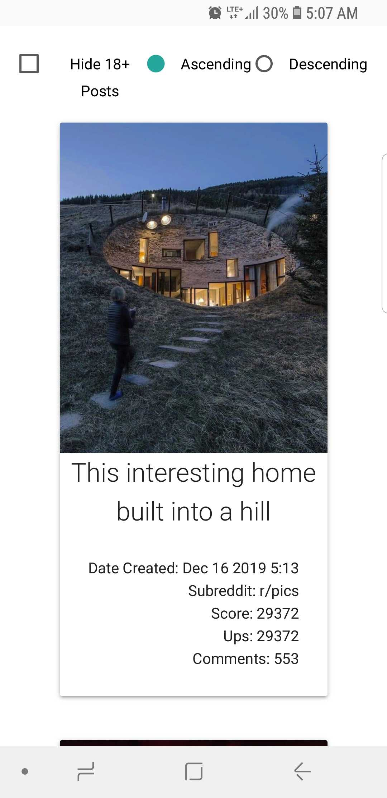

# Subreddit-app-viewer
___
### [Link to live site](https://subreddit-app-viewer.firebaseapp.com/)
___
## Minimum Viable Product
- use Reddit API and create filters to display content to web page
- filter and display by selected subreddit topics
- filter by comments,ups,and score in descending and ascending order
___
## App Description
- Application is using MaterializeCSS to be responsive on all platforms
- Application renders results based on what filters users selected

___
- example of selecting filters(desktop version)

- example of data presented from API 

- 100 images and data will be called from the api based on users filters
___
- Example of mobile phone displaying results

:heart: Jonathan